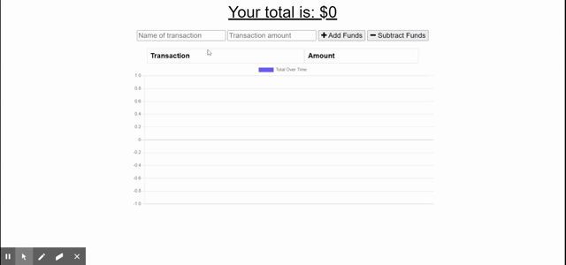

# Budget-Tracker
AS AN avid traveller
I WANT to be able to track my withdrawals and deposits with or without a data/internet connection
SO THAT my account balance is accurate when I am traveling

## Installation
* Open a terminal and run the commands:

  * `npm install`

  * `npm start`

## Usage
he user will be able to add expenses and deposits to their budget with or without a connection. When entering transactions offline, they should populate the total when brought back online.

Offline Functionality:

  * Enter deposits offline

  * Enter expenses offline

When brought back online:

  * Offline entries should be added to tracker.

## Link:
[Application Page](https://stormy-beach-79414.herokuapp.com/)